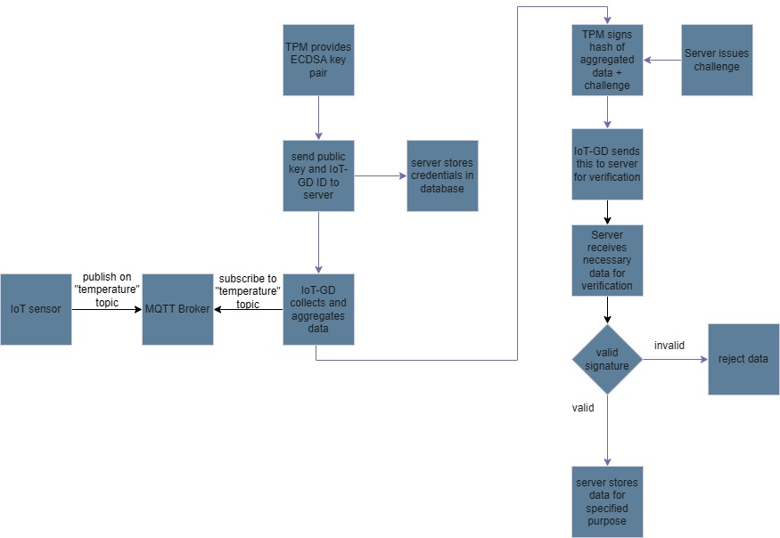

# IoT Attestation System
A TPM 2.0-backed distributed IoT system providing cryptographic verification of edge device telemetry. 

This project was developed as my dissertation project.

## Architecture

## System Overview

1. IoT-ED publishes sensor data to the MQTT Broker on the temperature topic
2. The Broker relays the data to any client subscribers
3. IoT-GD subscribes to the temperature topic and receives data
4. IoT-GD aggregates received data through taking the average
5. Upon IoT-GD initiating attestation, verification server passes a challenge to the IoT-GD
6. IoT-GD signs a hash of the data and challenge
7. Server verifies signature to determine integrity
8. Decision is made using result of verification: data is either stored or rejected

It is important to note that the data itself is not trusted, only that the data has passed through the trusted entity (IoT-GD).

## Components

### Gateway Device
Rust-based firmware running on Raspberry Pi with TPM integration for hardware-backed signing.

### Edge Device
Simulated Rust-based edge device for temperature sensing.

### Attestation Server
Backend service responsible for device enrollment, challenge-response attestation, and signature verification.

### MQTT Broker
Dockerised Mosquitto broker used for message transport.

## Tech Stack
- Rust
- Raspberry Pi
- TPM 2.0
- MQTT
- PostgreSQL
- Docker

## Extra Details

There is an exploration into Elliptic Curve Direct Anonymous Attestation (ECDAA) and its feasibility with the version of tss-esapi used at the time of development. 
This part of the project served as extension to determine whether the current system could
be anonymised and continue working as intended.

The result is that a full system implementation was not feasible purely in Rust with the aid
of the tss-esapi crate, yet includes /scripts within SageMath to aid the process.

As part of this project, a custom fork of the tss-esapi repository was created to facilitate
the development of the TPM2_Commit command as this was missing from the repository at the time.